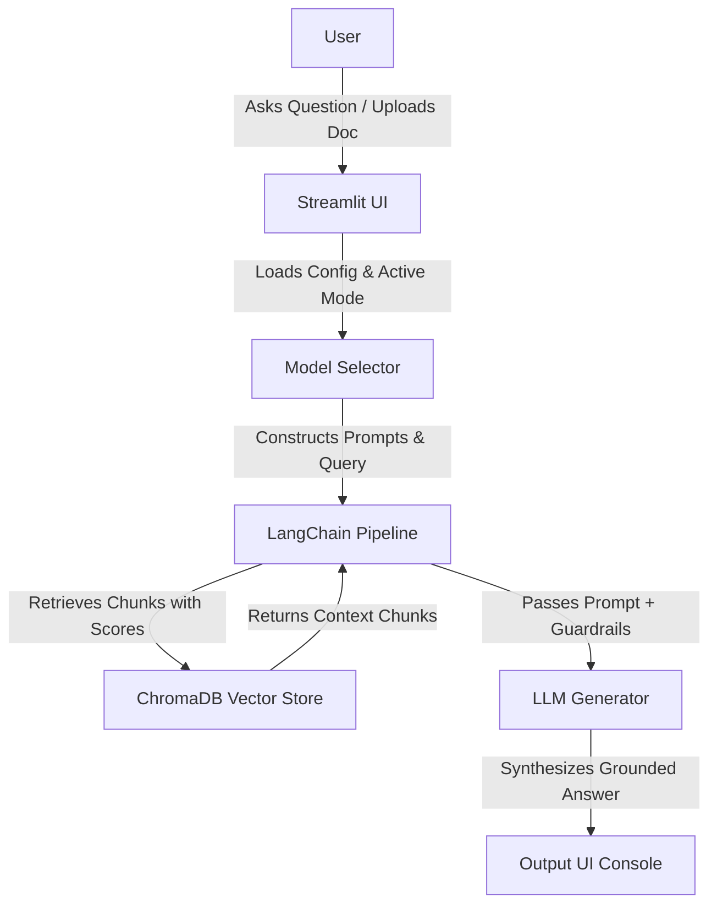

# DocSensei: Production-Grade Grounded RAG Application

DocSensei is a production-grade, modular Retrieval-Augmented Generation (RAG) platform optimized for processing educational curriculum materials and enterprise documents without data leakages or citation hallucinations.

---

## 🗺️ System Architecture

The following diagram illustrates the data flow of a user query through the DocSensei application:

---

## ✨ Core Features

1. **"Model Switcher" Engine:** A sidebar toggle allows swapping runtime components:
   * **Local Mode:** Powered completely offline by `Ollama` using `llama3.1` and `nomic-embed-text` embeddings.
   * **API Mode:** Powered by the `Google Gemini API` using `gemini-1.5-flash` and `gemini-embedding-001`.
2. **Grounded Retrieval (Anti-Hallucination Guardrails):**
   * Multi-stage safety checks prevent hallucinations.
   * A mathematical vector distance pre-flight check rejects questions whose closest matches are beyond a distance cutoff threshold.
   * If the LLM determines context is missing, it is constrained to output exactly: *"I do not know, as this information is not present in the provided document."* (Refusals suppress cited page badges).
3. **Modularity:** Separation of concerns ensures data loaders (`ingestion.py`), database structures (`vectorstore.py`), and model layers (`llm_providers.py`) are fully independent.

---

## 📂 File Directory Layout

*   `app.py`: Streamlit frontend dashboard, styling injection, and pipeline execution Orchestration.
*   `config.py`: Threshold cutoffs, chunk sizes, and active model name declarations.
*   `ingestion.py`: PyPDF and DOCX document processing loaders and recursive chunking.
*   `vectorstore.py`: ChromaDB database initialization and collection purge handlers.
*   `llm_providers.py`: Model loader instantiation for Gemini (API Mode) and Ollama (Local Mode).
*   `prompts.py`: strict citation prompting directives and source tagging formats.
*   `requirements.txt`: Python package dependency listings.

---
