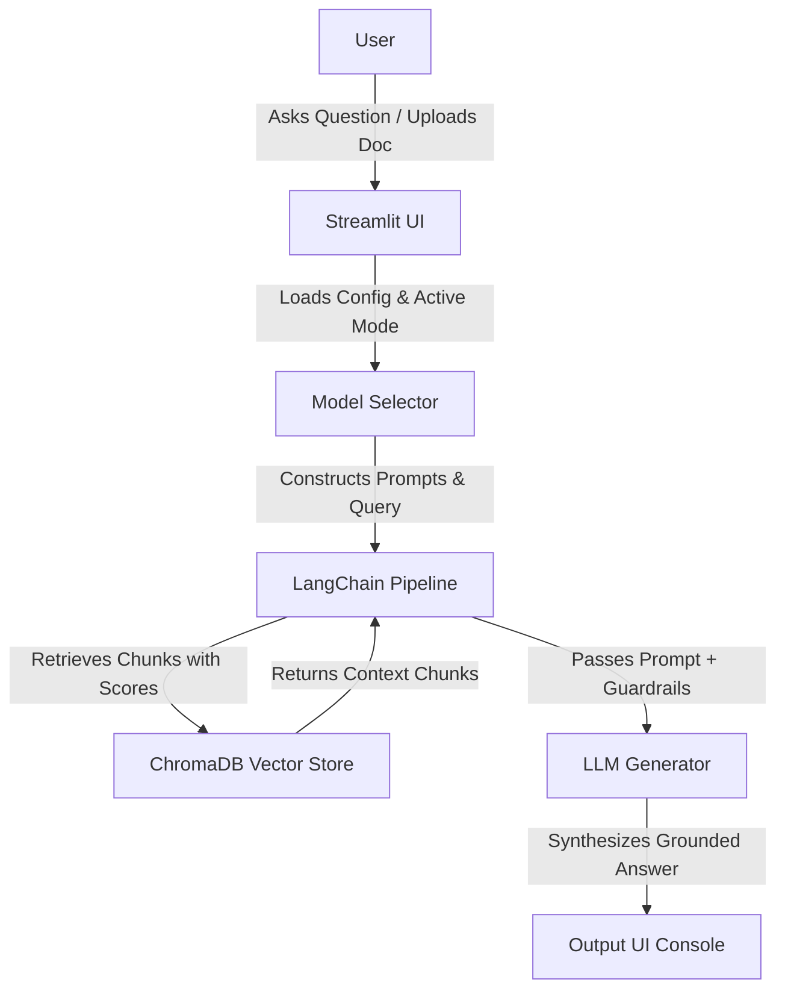

# DocSensei: Production-Grade Grounded RAG Application

DocSensei is a production-grade, modular Retrieval-Augmented Generation (RAG) platform optimized for processing educational curriculum materials and enterprise documents without data leakages or citation hallucinations.

---

## 🗺️ System Architecture

The following diagram illustrates the data flow of a user query through the DocSensei application:



---

## ✨ Core Features

1. **"Model Switcher" Engine:** A sidebar toggle allows swapping runtime components:
   * **Local Mode:** Powered completely offline by `Ollama` using `llama3.1` and `nomic-embed-text` embeddings.
   * **API Mode:** Powered by the `Google Gemini API` using `gemini-embedding-001` for vector embedding. It includes a sub-model switcher to dynamically swap the generation LLM (supporting *Gemini 3.1 Flash Lite*, *Gemini 3.5 Flash*, *Gemini 2.5 Flash Lite*, and *Gemini 3 Flash*) without affecting or requiring re-indexing of the document vector store.
2. **Grounded Retrieval (Anti-Hallucination Guardrails):**
   * Multi-stage safety checks prevent hallucinations.
   * A mathematical vector distance pre-flight check rejects questions whose closest matches are beyond a distance cutoff threshold.
   * If the LLM determines context is missing, it is constrained to output exactly: *"I do not know, as this information is not present in the provided document."* (Refusals suppress cited page badges).
3. **Modularity:** Separation of concerns ensures data loaders (`ingestion.py`), database structures (`vectorstore.py`), and model layers (`llm_providers.py`) are fully independent.

---

## 📂 File Directory Layout

```
├── llama_model/
│   ├── Meta-Llama-3.1-8B-Instruct-Q4_K_M.gguf
│   ├── Modelfile
│   ├── Modelfile_embed
│   └── nomic-embed-text.gguf
├── README.md
├── app.py
├── config.py
├── ingestion.py
├── llm_providers.py
├── prompts.py
├── requirements.txt
├── runtime.txt
├── setup_n_launch.bat
└── vectorstore.py
```

*   `app.py`: Streamlit frontend dashboard, custom styling injection, and pipeline execution orchestration.
*   `config.py`: Threshold cutoffs, chunk sizes, path configurations, and model definitions.
*   `ingestion.py`: PyPDF and DOCX document processing loaders and recursive chunking logic.
*   `llm_providers.py`: Instantiation of API (Gemini) and Local (Ollama/llama.cpp) LLM engines.
*   `prompts.py`: Strict instruction directives for citation grounding and answer formatting.
*   `requirements.txt`: Python package dependencies.
*   `runtime.txt`: Version declaration of the Python runtime.
*   `setup_n_launch.bat`: Automated environment build and dashboard startup batch script.
*   `vectorstore.py`: Local ChromaDB vector database creation, querying, and maintenance script.
*   `llama_model/`: Local model repository directory.
    *   `Meta-Llama-3.1-8B-Instruct-Q4_K_M.gguf`: Quantized local Llama 3.1 8B Instruct model.
    *   `nomic-embed-text.gguf`: Local text embedding model.
    *   `Modelfile` / `Modelfile_embed`: Manifest configuration files to build/import the model formats in Ollama.

---

## How to start?
Just run the "setup_n_launch.bat" file to start. (Have a Active Internet connection to download the dependencies.)

---
